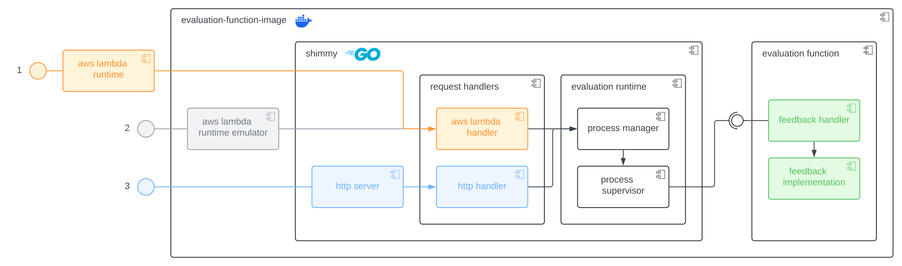

# Lambda Feedback Evaluation Function Shim

`evaluation-function-shim` is a shim written in Go that interacts with language-agnostic evaluation functions as part of the lambda feedback platform, and exposes them as a RESTful API.

## Overview

The shim listens for incoming HTTP requests / events from feedback clients, validates the incoming data, and forwards it to the underlying evaluation function. The shim is responsible for managing the lifecycle of the evaluation function, and ensures that it is available to process incoming requests. The evaluation function is expected to be a executable application that implements the evaluation runtime interface.

This abstraction allows the evaluation function to be written in any language, and provides a consistent interface for interacting with the lambda feedback platform. Moreover, the shim provides common functionality such as logging, error handling, and request validation, which simplifies the development of evaluation functions and allows developers to focus on the core logic.

### Architecture

The shim is designed to be a lightweight, stateless, OS- and architecture-agnostic binary that is intended to be run alongside other, containerized applications. The shim handles incoming evaluation requests, and forwards them to the evaluation function. The evaluation function is expected to be a standalone application that implements the evaluation runtime interface, and is managed by the shim. The following diagram illustrates the architecture of the shim:



As shown in the diagram, the shim allows the evaluation function to be deployed in three different execution environments, all supported out of the box:

1. **AWS Lambda (managed)**: The evaluation function image is deployed as an AWS Lambda function. The shim implements the AWS Lambda runtime interface, and forwards incoming events to the evaluation function. This allows the evaluation function to be executed in a serverless environment.

2. **AWS Lambda (self-hosted)**: The evaluation function image contains the [AWS Lambda Runtime Interface Emulator](https://github.com/aws/aws-lambda-runtime-interface-emulator). The shim implements the AWS Lambda runtime interface, and forwards incoming events to the evaluation function. This allows the evaluation function to be executed in a local or self-hosted environment, while maintaining compatibility with the AWS Lambda runtime interface.

3. **Standalone (self-hosted)**: The shim includes a standalone HTTP server that listens for incoming evaluation requests. As with the other environments, the shim forwards incoming requests to the evaluation function. This allows for maximum deployment flexibility, without being restricted to a specific runtime environment.

## Usage

`shimmy --help` displays the available command-line options:

```shell
NAME:
   shimmy - A shim for running arbitrary, language-agnostic evaluation
            functions on arbitrary, serverless platforms.

USAGE:
   shimmy [global options] command [command options] [arguments...]

COMMANDS:
   handle  Start the AWS Lambda handler
   serve   Start a http server and listen for events.

GLOBAL OPTIONS:
   --help, -h          show help
   --log-format value  set the log format. Options: production, development. [$LOG_FORMAT]
   --log-level value   set the log level. Options: debug, info, warn, error, panic, fatal. [$LOG_LEVEL]
   --version           print the version

   function

   --arg value, -a value          additional arguments to pass to the worker process. [$FUNCTION_ARGS]
   --command value, -c value      the command to invoke in order to start the worker process. [$FUNCTION_COMMAND]
   --cwd value, -d value          the working directory to use when invoking the worker process. [$FUNCTION_WORKING_DIR]
   --env value, -e value          additional environment variables to pass to the worker process. [$FUNCTION_ENV]
   --interface value, -i value    the interface to use for communication with the worker process. Options: stdio, file. (default: "stdio") [$FUNCTION_INTERFACE]
   --max-workers value, -n value  (default: 1) [$FUNCTION_MAX_PROCS]
   --persistent, -p               the worker process is capable of handling more than one event. (default: false) [$FUNCTION_DISPOSABLE]
```

## Evaluation Runtime Interface

The evaluation function is expected to be a standalone application or script that implements the evaluation runtime interface. The evaluation runtime interface is a simple, language-agnostic, JSON-based protocol that defines how the shim communicates with the evaluation function.

The evaluation function is responsible for parsing the input JSON message, performing the evaluation, and responding with the output JSON message. The evaluation function should exit with a status code of `0` if the evaluation was successful, and a non-zero status code if an error occurred.

### Messages

The interface consists of input and output messages, which are exchanged between the shim and the evaluation function. Both the input and output to the evaluation function are expected to be valid JSON messages, conforming to the schema defined in the following.

#### Input

The input message is a JSON-encoded object that contains the following fields:

- `$id` (int, optional): A unique identifier for the evaluation request.
- `command` (string): The command to be executed by the evaluation function.
- `*` (object): The input data for the evaluation function.

> The `$id` field is not used for file-based communication.

The object should follow one of the following schemas, depending on the command:

- `eval`: [Evaluation Schema](./runtime/schema/request-eval.json)
- `preview`: [Preview Schema](./runtime/schema/request-preview.json)

An example input message for the `evaluate` command is shown below:

```json
{
  "$id": 1,
  "command": "eval",
  "response": "...",
  "answer": "...",
  "params": {
    "param1": "..."
  }
}
```

#### Output

The output message is expected to be a JSON-encoded string that contains the following fields:

- `$id` (int, optional): The unique identifier of the evaluation request.
- `*` (object): The output data from the evaluation function.

> The `$id` field is not used for file-based communication.

The object should follow one of the following schemas, depending on the command:

- `eval`: [Evaluation Schema](./runtime/schema/response-eval.json)
- `preview`: [Preview Schema](./runtime/schema/response-preview.json)

An example output message for the `evaluate` command is shown below:

```json
{
  "$id": 1,
  "result": {
    "is_correct": "..."
  }
}
```

### Communication Channels

The shim is capable of communicating with the evaluation function using two different channels:

1. **Standard I/O (stdio)**: The shim communicates with the evaluation function using standard input and output. The evaluation function reads the input JSON object from standard input, and writes the output JSON object to standard output.

2. **File System (file)**: The shim communicates with the evaluation function using the file system. The evaluation function is expected to read the input JSON object from a file, and write the output JSON object to a file.

   The file paths are always the last two command-line arguments passed to the evaluation function.

   For example, a wolframscript evaluation function in `evaluation.wl`, that reads the input JSON object from a file named `input.json` and writes the output JSON object to a file named `output.json` would be invoked as follows:

   ```shell
   wolframscript -file evaluation.wl input.json output.json
   ```
