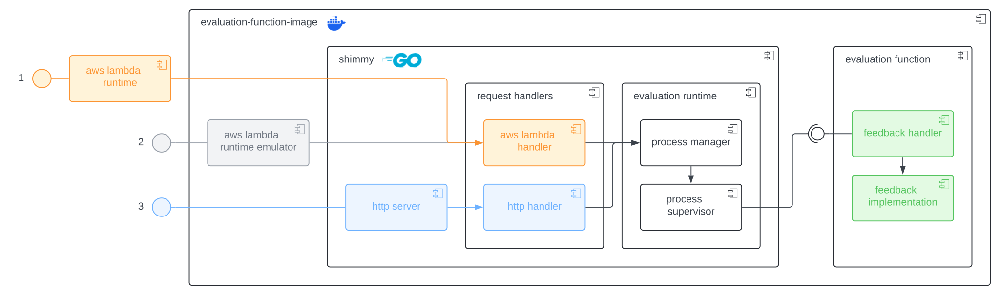

# Lambda Feedback Evaluation Function Shim

Shimmy is a shim written in Go that interacts with language-agnostic evaluation functions as part of the lambda feedback platform, and exposes them as a RESTful API.

## Background

This project was originally developed as part of a Master's dissertation: [Andreas Pfrutscheller, *MSc Report* (2024)](https://github.com/user-attachments/files/27594869/2024_AndreasPfrutscheller_MSc_report.pdf).

## Overview

Shimmy listens for incoming HTTP requests / events from feedback clients, validates the incoming data, and forwards it to the underlying evaluation function. The shim is responsible for managing the lifecycle of the evaluation function, and ensures that it is available to process incoming requests. The evaluation function is expected to be a executable application that implements the evaluation runtime interface.

This abstraction allows the evaluation function to be written in any language, and provides a consistent interface for interacting with the lambda feedback platform. Moreover, the shim provides common functionality such as logging, error handling, and request validation, which simplifies the development of evaluation functions and allows developers to focus on the core logic.

### Architecture

Shimmy is designed to be a lightweight, stateless, OS- and architecture-agnostic binary that is intended to be run alongside other, containerized applications. The shim handles incoming evaluation requests, and forwards them to the evaluation function. The evaluation function is expected to be a standalone application that implements the evaluation runtime interface, and is managed by the shim. The following diagram illustrates the architecture of the shim:



As shown in the diagram, the shim allows the evaluation function to be deployed in three different execution environments, all supported out of the box:

1. **AWS Lambda (managed)**: The evaluation function image is deployed as an AWS Lambda function. The shim implements the AWS Lambda runtime interface, and forwards incoming events to the evaluation function. This allows the evaluation function to be executed in a serverless environment.

2. **AWS Lambda (self-hosted)**: The evaluation function image contains the [AWS Lambda Runtime Interface Emulator](https://github.com/aws/aws-lambda-runtime-interface-emulator). The shim implements the AWS Lambda runtime interface, and forwards incoming events to the evaluation function. This allows the evaluation function to be executed in a local or self-hosted environment, while maintaining compatibility with the AWS Lambda runtime interface.

3. **Standalone (self-hosted)**: The shim includes a standalone HTTP server that listens for incoming evaluation requests. As with the other environments, the shim forwards incoming requests to the evaluation function. This allows for maximum deployment flexibility, without being restricted to a specific runtime environment.

## Usage

`shimmy --help` displays the available command-line options:

```shell
NAME:
   shimmy - A shim for running arbitrary, language-agnostic evaluation
            functions on arbitrary, serverless platforms.

USAGE:
   shimmy [global options] command [command options] [arguments...]

VERSION:
   local

COMMANDS:
   lambda  Run the AWS Lambda handler.
   run     Detect execution environment and start shim.
   serve   Start a http server and listen for events.

GLOBAL OPTIONS:
   --help, -h          show help
   --log-format value  set the log format. Options: production, development. [$LOG_FORMAT]
   --log-level value   set the log level. Options: debug, info, warn, error, panic, fatal. [$LOG_LEVEL]
   --version           print the version

   auth

   --auth-key value, -k value  the authentication key to use for incoming requests. [$AUTH_KEY]

   progress

   --progress-callback-timeout value          the timeout for a single progress callback delivery. (default: 1s) [$PROGRESS_CALLBACK_TIMEOUT]
   --progress-allowed-hosts value [ --progress-allowed-hosts value ]  restrict progress callback URLs to these hosts. Entries may be an exact hostname or a "*.example.com" wildcard. Unset allows any host, subject to the private-network guard below. [$PROGRESS_ALLOWED_HOSTS]
   --progress-allow-private-networks          allow progress callback delivery to loopback, link-local, and private IP addresses. Leave disabled unless the callback target is known to live on a trusted private network. (default: false) [$PROGRESS_ALLOW_PRIVATE_NETWORKS]
   --progress-sidecar-max-body-bytes value     the maximum size, in bytes, of a single worker-authored progress event POST. (default: 16384) [$PROGRESS_SIDECAR_MAX_BODY_BYTES]
   --progress-sidecar-max-events value         the maximum number of worker-authored progress events relayed per evaluation. (default: 50) [$PROGRESS_SIDECAR_MAX_EVENTS]
   --progress-sidecar-burst-size value          how many worker-authored progress events at the start of an evaluation are exempt from the minimum spacing below, so a handful of legitimate back-to-back checkpoints aren't rate limited. (default: 5) [$PROGRESS_SIDECAR_BURST_SIZE]
   --progress-sidecar-min-event-interval value  the minimum spacing between worker-authored progress events relayed per evaluation, once the burst allowance above is used up. (default: 10ms) [$PROGRESS_SIDECAR_MIN_EVENT_INTERVAL]
   --progress-sidecar-unbind-grace-period value  how long to keep relaying worker-authored progress events after a request returns, so a fire-and-forget POST dispatched just before the result can still land. (default: 250ms) [$PROGRESS_SIDECAR_UNBIND_GRACE_PERIOD]
   --progress-stream-enabled                   stream progress back on the /evaluate and /chat responses as Server-Sent Events for requests that send 'Accept: text/event-stream' and negotiate 'X-Api-Version: 0.1.1-dev'. Standalone/serve mode only; ignored under AWS Lambda. (default: true) [$PROGRESS_STREAM_ENABLED]
   --progress-stream-heartbeat-seconds value   seconds between SSE heartbeat comments sent while an evaluation runs, so an idle streamed connection isn't dropped by an intermediary. 0 disables heartbeats. (default: 15) [$PROGRESS_STREAM_HEARTBEAT_SECONDS]

   function

   --arg value, -a value [ --arg value, -a value ]  additional arguments for to the worker process. [$FUNCTION_ARGS]
   --command value, -c value                        the command to invoke to start the worker process. [$FUNCTION_COMMAND]
   --cwd value, -d value                            the working directory for the worker process. [$FUNCTION_WORKING_DIR]
   --env value, -e value [ --env value, -e value ]  additional environment variables for the worker process. [$FUNCTION_ENV]
   --interface value, -i value                      the interface to use for worker process communication. Options: rpc, file. (default: "rpc") [$FUNCTION_INTERFACE]
   --max-workers value, -n value                    the maximum number of worker processes to run concurrently. (default: number of CPU cores) [$FUNCTION_MAX_PROCS]

   rpc

   --rpc-transport value, -t value     the transport to use for the RPC interface. Options: stdio, ipc, http, tcp, ws. (default: "stdio") [$FUNCTION_RPC_TRANSPORT]
   --rpc-transport-http-url value      the url to use for the HTTP transport. Default: http://127.0.0.1:7321 (default: "http://127.0.0.1:7321") [$FUNCTION_RPC_TRANSPORT_HTTP_URL]
   --rpc-transport-ipc-endpoint value  the IPC endpoint to use for the IPC transport. Default: /tmp/eval.sock [$FUNCTION_RPC_TRANSPORT_IPC_ENDPOINT]
   --rpc-transport-tcp-address value   the address to use for the TCP transport. Default: 127.0.0.1:7321 (default: "127.0.0.1:7321") [$FUNCTION_RPC_TRANSPORT_TCP_ADDRESS]
   --rpc-transport-ws-url value        the url to use for the WebSocket transport. Default: ws://127.0.0.1:7321 (default: "ws://127.0.0.1:7321") [$FUNCTION_RPC_TRANSPORT_WS_URL]

   worker

   --worker-send-timeout value   the timeout for a single message send operation. (default: 30s) [$FUNCTION_WORKER_SEND_TIMEOUT]
   --worker-start-timeout value  the duration to wait for the application to start (worker process boot + first successful RPC dial). (default: 15s) [$FUNCTION_WORKER_START_TIMEOUT]
   --worker-stop-timeout value   the duration to wait for a worker process to stop. (default: 5s) [$FUNCTION_WORKER_STOP_TIMEOUT]
```

## Evaluation Runtime Interface

The evaluation function is expected to be a standalone application or script that implements the evaluation runtime interface. The evaluation runtime interface is a simple, language-agnostic, JSON-based protocol that defines how the shim communicates with the evaluation function.

The evaluation function is responsible for parsing the input JSON message, performing the evaluation, and responding with the output JSON message. The evaluation function should exit with a status code of `0` if the evaluation was successful, and a non-zero status code if an error occurred.

### Messages

The shim exposes an HTTP API. Clients send a `POST` request to the shim; the shim validates the body, forwards it to the evaluation function, and returns the result.

The command to execute is determined by the `command` HTTP header on the incoming request. If the header is absent the shim defaults to `eval`.

#### Input

The HTTP request body is a JSON object. The required fields depend on the command:

- `eval`: [Evaluation Schema](./runtime/schema/request-eval.json) — requires `response` and `answer`
- `preview`: [Preview Schema](./runtime/schema/request-preview.json) — requires `response`
- `healthcheck`: no body required

An example request body for `eval`:

```json
{
  "response": "...",
  "answer": "...",
  "params": {
    "param1": "..."
  }
}
```

#### Output

On success the shim returns a JSON object with a `result` field. On failure it returns an `error` field instead.

The `result` object shape depends on the command:

- `eval`: [Evaluation Schema](./runtime/schema/response-eval.json)
- `preview`: [Preview Schema](./runtime/schema/response-preview.json)
- `healthcheck`: [Health Schema](./runtime/schema/response-health.json)

Example success response for `eval`:

```json
{
  "command": "eval",
  "result": {
    "is_correct": true,
    "feedback": "..."
  }
}
```

Example error response:

```json
{
  "error": {
    "message": "Something went wrong",
    "error_thrown": {}
  }
}
```

### Cases

The `eval` command supports an optional `cases` array inside `params`. Cases let you define alternative correct answers with their own feedback, handled entirely by the shim without any changes to the evaluation function.

If the evaluation function returns `is_correct: false`, the shim iterates through the cases in order and re-evaluates with each case's `answer` (merged with the top-level `params`). The first case whose evaluation returns `is_correct: true` is used as the match.

When a case matches, the shim replaces the result's `feedback` with the case's `feedback` and records the matched case index in `matched_case`. If the case defines a `mark` field (`0` or `1`), it also overrides `is_correct` in the result.

Each case object supports the following fields:

| Field | Required | Description |
|-------|----------|-------------|
| `answer` | yes | The alternative answer to evaluate against. |
| `feedback` | yes | The feedback string to return if this case matches. |
| `params` | no | Additional params merged (with precedence) over the top-level `params`. |
| `mark` | no | `1` sets `is_correct: true` in the result; `0` sets it `false`. |
| `params.override_eval_feedback` | no | If `true`, appends the original eval feedback to the case `feedback`. |

Example request using cases:

```json
{
  "response": "x^2",
  "answer": "x**2",
  "params": {
    "cases": [
      {
        "answer": "x^2",
        "feedback": "Correct, but use ** for exponentiation.",
        "mark": 1
      },
      {
        "answer": "x * x",
        "feedback": "Equivalent, but not the expected form.",
        "params": { "override_eval_feedback": true }
      }
    ]
  }
}
```

### Progress Events

The shim also exposes µEd-compatible endpoints at `POST /evaluate` and `POST /chat` (see the [µEd spec](https://mued.org/spec)), separate from the legacy `POST /` endpoint documented above. When a client calls either with a `callbackUrl` in the request body, the shim POSTs a small JSON event to that URL at each stage of processing — in addition to, not instead of, the normal synchronous HTTP response.

This lets a caller show progress to the end user (e.g. "Starting…") without polling, and without the shim needing to hold a connection open. It works identically whether the shim is deployed standalone or on AWS Lambda.

To opt in, include `callbackUrl` in the request body and, optionally, an `X-Request-Id` header — both are part of the µEd spec's own request contract, not shim-specific additions. Every event echoes back the `X-Request-Id` value verbatim so the caller can correlate it with the original request.

```json
{
  "submission": { "type": "TEXT", "content": { "text": "..." } },
  "task": { "referenceSolution": { "text": "..." } },
  "callbackUrl": "https://your-service.example.com/hooks/shimmy-progress"
}
```

Stages, in order:

| Stage | Producer | Meaning |
|-------|----------|---------|
| `preparing` | shim | A worker is being made ready (freshly booted or reused from the pool). Emitted once per request. |
| `starting` | shim | The worker is about to be invoked. Emitted once per request. |
| `evaluating` | worker | A progress checkpoint the evaluation function reported during an `/evaluate` (or `/preview`) call. Zero or more, in the function's own order. |
| `thinking` | worker | The `/chat` equivalent of `evaluating` — a checkpoint the chat function reported. |
| `completed` | shim | The result has been computed. For `/evaluate`, `data.feedback` carries the same array as the synchronous body; for `/chat`, `data.output` carries the message. |
| `failed` | shim | A terminal failure occurred. `message` is a short end-user-safe line; `error` is an `ErrorResponse` object (`title`, optional `message`/`code`/`trace`/`details`) for programmatic handling and logs. |

`completed` and `failed` are terminal — at most one of them is delivered per request, whichever occurs first. `preparing` and `starting` are each delivered at most once even for a multi-case evaluation that internally re-enters those stages per case.

Example event body:

```json
{
  "correlationId": "req-7c193f38",
  "stage": "starting",
  "command": "eval",
  "message": "Starting…",
  "timestamp": "2026-08-04T14:23:01.512Z"
}
```

Example terminal event, with the feedback payload attached:

```json
{
  "correlationId": "req-7c193f38",
  "stage": "completed",
  "command": "eval",
  "message": "Feedback is ready.",
  "data": {
    "feedback": [
      { "awardedPoints": 1, "message": "Well done" }
    ]
  },
  "timestamp": "2026-08-04T14:23:02.310Z"
}
```

A `failed` terminal event carries an `error` object instead of `data`:

```json
{
  "correlationId": "req-7c193f38",
  "stage": "failed",
  "command": "eval",
  "message": "We couldn't evaluate your answer. Please try again.",
  "error": {
    "title": "Evaluation failed",
    "message": "We couldn't evaluate your answer. Please try again.",
    "code": "INTERNAL_ERROR",
    "trace": "worker send: context deadline exceeded"
  },
  "timestamp": "2026-08-04T14:23:02.310Z"
}
```

Delivery is best-effort and never blocks or fails the evaluation itself: each callback POST is bounded by `--progress-callback-timeout` (default `1s`, see [Usage](#usage)); a slow, unreachable, or erroring receiver is logged and skipped, never surfaced to the caller as an evaluation failure.

#### Callback URL safety (SSRF protection)

Since `callbackUrl` is caller-supplied, the shim guards against it being used to reach services it shouldn't be able to reach:

- **By default**, callback delivery refuses to dial loopback, link-local (this includes cloud metadata endpoints like `169.254.169.254`), and private (RFC1918/RFC4193) IP addresses — checked against the address actually resolved and dialed, not just the URL's literal hostname, so a public-looking domain that resolves to a private address is still blocked. Set `--progress-allow-private-networks` only if the callback target is known to live on a private network you trust (e.g. a same-VPC service).
- **`--progress-allowed-hosts`** optionally restricts callback URLs to an explicit list of hostnames (exact match, or `*.example.com` wildcards). Unset means any (non-private) host is accepted.

A rejected callback URL behaves like any other delivery failure: it's logged and skipped, never surfaced to the caller as an evaluation failure.

> **Note:** the µEd spec describes `callbackUrl` for asynchronous *final-result* delivery — the service may return `202 Accepted` immediately and POST the result later. The shim doesn't implement that 202 flow; it always responds synchronously with `200 OK` and the feedback body as normal. It reuses the same `callbackUrl` field to additionally deliver progress events — including the final feedback, via the `completed` event's `data` field — rather than requiring a shim-specific header for the same concept.

#### Streaming progress on the response itself (Server-Sent Events)

A caller that would rather receive progress on the `/evaluate` or `/chat` response than
stand up a `callbackUrl` receiver can opt in with an `Accept: text/event-stream` request
header. The shim then keeps the response open and streams [Server-Sent Events](https://developer.mozilla.org/en-US/docs/Web/API/Server-sent_events)
as the request runs, instead of the buffered JSON body.

- **Requires the `0.1.1-dev` µEd API version.** SSE progress streaming is a shimmy
  extension not yet in the published µEd `0.1.0` contract, pending upstream standardisation,
  so it lives in a separate `0.1.1-dev` version. Select it with an `X-Api-Version: 0.1.1-dev`
  request header; a request that resolves to `0.1.0` (the pinned default for header-less
  clients) always gets the buffered JSON body even with `Accept: text/event-stream`.
- **Standalone / `serve` mode only.** Under AWS Lambda the proxy buffers the whole response,
  so the `Accept` header is ignored and the normal buffered JSON body is returned. Disable it
  everywhere with `--progress-stream-enabled=false`.
- Works alongside `callbackUrl`: if a request carries both, every event is delivered to the
  stream **and** POSTed to the callback.
- The connection is bound to the request context — if the caller disconnects, the work is
  cancelled.

Each non-terminal event is written as its own frame the moment it occurs, so the caller sees
progress live (`/evaluate` shown; `/chat` is identical but with `thinking` frames in place
of `evaluating`):

```
event: preparing
data: {"stage":"preparing","message":"Preparing…","timestamp":"2026-08-31T09:16:29.474Z"}

event: starting
data: {"stage":"starting","message":"Starting…","timestamp":"2026-08-31T09:16:29.474Z"}

event: evaluating
data: {"stage":"evaluating","message":"Ran 3/10 cases","data":{"completed":3,"total":10},"timestamp":"2026-08-31T09:16:29.522Z"}
```

`preparing` and `starting` (the shim's own markers) are streamed **once per request** even
though a multi-case evaluation re-enters them per case; worker-authored `evaluating` /
`thinking` sub-steps are streamed every time. The `event:` line carries the stage; the
`data` payload is a self-contained step object (`stage`, `message`, optional `data`,
`timestamp`).

The stream then ends with exactly one terminal frame — `event: completed` or `event: failed`
— carrying the endpoint's normal `200` body plus every step that preceded it, and the
connection closes:

```
event: completed
data: {"feedback":[{"awardedPoints":1,"message":"Well done"}],
       "steps":[{"stage":"preparing","message":"Preparing…","timestamp":"…"},
                {"stage":"starting","message":"Starting…","timestamp":"…"},
                {"stage":"evaluating","message":"Ran 3/10 cases","data":{"completed":3,"total":10},"timestamp":"…"}]}
```

```
event: failed
data: {"feedback":null,
       "steps":[ /* whatever streamed before the failure */ ],
       "error":{"title":"Evaluation failed",
                "message":"We couldn't evaluate your answer. Please try again.",
                "code":"INTERNAL_ERROR",
                "trace":"worker send: context deadline exceeded"}}
```

For `/chat` the terminal frame carries `output` (and optional `metadata`) instead of
`feedback`:

```
event: completed
data: {"output":{"role":"ASSISTANT","content":"…"},
       "metadata":{ /* optional, worker-supplied */ },
       "steps":[ /* preparing, starting, thinking… */ ]}
```
A failed `/chat` frame has `"output":null` plus the same `error` object.

Each element of the terminal frame's `steps[]` is byte-identical to the `data` payload of the
live frame that carried it. The HTTP status is `200` even for a `failed` frame — the failure
is in-band. The terminal frame's `data` is the µEd spec's `SseEvaluateTerminalFrame` /
`SseChatTerminalFrame`; on failure its `error` is a standard `ErrorResponse`. The correlation
id is in the `X-Request-Id` response header, not the body. Response headers: `Content-Type:
text/event-stream`, `Cache-Control: no-cache`, `X-Accel-Buffering: no`, no `Content-Length`.

While the request runs, the shim also writes an SSE comment heartbeat (`: ping`) every
`--progress-stream-heartbeat-seconds` seconds (default `15`; `0` disables) so an idle
connection isn't dropped by an intermediary.

#### Custom progress events from the evaluation function

The `preparing` and `starting` stages are emitted by shimmy itself, around the worker call as a whole. An evaluation or chat function that does multiple steps internally (e.g. several model calls) can emit its own progress events *during* that span, which are relayed through the same `callbackUrl` (and SSE stream) alongside shimmy's own events.

When a request opts in to progress reporting (via `callbackUrl`), shimmy starts a loopback-only HTTP listener and passes its address to the evaluation function process as the `EVAL_PROGRESS_URL` environment variable, the same way it passes `EVAL_RPC_TRANSPORT`, `EVAL_FILE_NAME_REQUEST`, etc. (see [Communication Channels](#communication-channels) below). This works identically regardless of interface (`rpc` or `file`) or RPC transport, and regardless of the evaluation function's language — it only needs to be able to make an HTTP POST.

To emit a custom event, `POST` a small JSON body to `EVAL_PROGRESS_URL`:

```json
{
  "message": "Checking correctness…",
  "data": { "step": 2, "of": 3 }
}
```

- `message` (string, required): student/teacher-facing text.
- `data` (object, optional): free-form, passed through as-is.
- There is no `stage` field, by design: a worker can never choose its own stage. The shim assigns one from the command in flight — `evaluating` for an `/evaluate` (or `/preview`) request, `thinking` for `/chat` — and the shim-only stages `preparing`, `starting`, `completed`, and `failed` are never available to a worker.

The response status is informational only — the evaluation function should treat every response as fire-and-forget and never fail on a non-2xx status. Delivery is best-effort, same as outbound callback delivery: `202` accepted (delivery to `callbackUrl` is then attempted in the background), `400` malformed body or empty `message`, `413` body too large, `429` rate limited, `503` no request currently associated with the listener (e.g. a stray POST arriving after both the request has finished and the grace period below has elapsed).

To bound how much an evaluation function (which may be running untrusted, sandboxed code) can push through this channel, events are capped before relay:

| Flag | Env var | Default | Description |
|------|---------|---------|-------------|
| `--progress-sidecar-max-body-bytes` | `PROGRESS_SIDECAR_MAX_BODY_BYTES` | `16384` | Maximum size, in bytes, of a single event POST. |
| `--progress-sidecar-max-events` | `PROGRESS_SIDECAR_MAX_EVENTS` | `50` | Maximum number of events relayed per evaluation. |
| `--progress-sidecar-burst-size` | `PROGRESS_SIDECAR_BURST_SIZE` | `5` | Events at the start of a span exempt from the minimum spacing below, so a handful of legitimate back-to-back checkpoints aren't rate limited. |
| `--progress-sidecar-min-event-interval` | `PROGRESS_SIDECAR_MIN_EVENT_INTERVAL` | `10ms` | Minimum spacing between relayed events, once the burst allowance is used up. |
| `--progress-sidecar-unbind-grace-period` | `PROGRESS_SIDECAR_UNBIND_GRACE_PERIOD` | `250ms` | How long the listener keeps relaying after a request returns, so a fire-and-forget event POST dispatched by the worker just before returning its result still has a window to land. |

> **Sandboxing note:** under `--sandbox` alone, the worker keeps the host network namespace and can reach the loopback listener normally. Only the separate, explicit `--sandbox-disable-network` flag isolates networking (and loopback specifically) — under that flag, custom progress events are silently dropped, the same as any other best-effort delivery failure.

This is a shim-side contract only; no client library ships in this repo. Evaluation function libraries (e.g. per-language toolkits) can build a thin wrapper around reading `EVAL_PROGRESS_URL` and POSTing to it.

### Communication Channels

The shim supports two interface modes, selected with `--interface`:

#### RPC (`--interface rpc`, default)

The shim keeps the evaluation function running as a persistent process and communicates with it via [JSON-RPC 2.0](https://www.jsonrpc.org/specification). The evaluation function must implement a JSON-RPC 2.0 server. The transport used for the RPC connection is selected with `--rpc-transport`:

| Transport | Description |
|-----------|-------------|
| `stdio` (default) | JSON-RPC 2.0 messages over stdin/stdout. |
| `ipc` | Unix socket (Linux/macOS) or named pipe (Windows). |
| `http` | HTTP POST to a local URL. Experimental — custom TLS and timeout configuration is not yet supported. |
| `tcp` | Raw TCP connection. |
| `ws` | WebSocket connection. Experimental — custom dialer configuration is not yet supported. |

The shim injects the following environment variables into the evaluation function process so it can identify the transport it should listen on:

| Variable | Value |
|----------|-------|
| `EVAL_IO` | `rpc` |
| `EVAL_RPC_TRANSPORT` | Transport name (e.g. `stdio`) |
| `EVAL_RPC_IPC_ENDPOINT` | IPC endpoint path (IPC transport only) |
| `EVAL_RPC_HTTP_URL` | HTTP URL (HTTP transport only) |
| `EVAL_RPC_WS_URL` | WebSocket URL (WS transport only) |
| `EVAL_RPC_TCP_ADDRESS` | TCP address (TCP transport only) |
| `EVAL_PROGRESS_URL` | Local URL to POST [custom progress events](#custom-progress-events-from-the-evaluation-function) to (only set when the request opted in via `callbackUrl`) |

#### File System (`--interface file`)

The shim starts a fresh evaluation function process for each request, passing the input and output file paths as the last two command-line arguments. The evaluation function reads the input JSON from the input file and writes the output JSON to the output file, then exits.

The input file contains a JSON object with the following structure:

```json
{
  "command": "eval",
  "params": {
    "response": "...",
    "answer": "...",
    "params": {}
  }
}
```

The shim also sets the following environment variables:

| Variable | Value |
|----------|-------|
| `EVAL_IO` | `FILE` |
| `EVAL_FILE_NAME_REQUEST` | Path to the input file |
| `EVAL_FILE_NAME_RESPONSE` | Path to the output file |
| `EVAL_PROGRESS_URL` | Local URL to POST [custom progress events](#custom-progress-events-from-the-evaluation-function) to (only set when the request opted in via `callbackUrl`) |

> Using the file interface is recommended for large payloads such as base64-encoded images.

For example, a Wolfram Language evaluation function in `evaluation.wl` would be invoked as:

```shell
wolframscript -file evaluation.wl /tmp/shimmy/abc/request-data-123 /tmp/shimmy/abc/response-data-456
```

### Sandboxed Execution (Linux only, experimental)

Shimmy can wrap each worker process in an [nsjail](https://github.com/google/nsjail) sandbox to safely execute arbitrary, untrusted code. The sandbox provides:

- **Filesystem confinement** — the worker can only access explicitly bind-mounted paths
- **Resource limits** — CPU time, memory, and file descriptor caps
- **Network isolation** — optional; disables all outbound connections
- **Unprivileged UID** — worker runs as `nobody` (uid 65534) inside the jail

Sandboxing requires Linux and the `nsjail` binary. The Docker image built from the project's `Dockerfile` includes nsjail at `/usr/sbin/nsjail`. On the host, install it with `sudo apt install nsjail` (Ubuntu 22.04+) or build from source.

Enable sandboxing with `--sandbox` and configure it with the flags below:

| Flag | Env var | Default | Description |
|------|---------|---------|-------------|
| `--sandbox` | `SANDBOX_ENABLED` | `false` | Enable nsjail sandboxing |
| `--sandbox-nsjail-path` | `SANDBOX_NSJAIL_PATH` | `/usr/sbin/nsjail` | Path to the nsjail binary |
| `--sandbox-ro-bind` | `SANDBOX_RO_BINDS` | — | Host path to bind-mount read-only (repeatable) |
| `--sandbox-rw-bind` | `SANDBOX_RW_BINDS` | — | Host path to bind-mount read-write (repeatable) |
| `--sandbox-tmpfs` | `SANDBOX_TMPFS` | — | Path inside the sandbox to mount as tmpfs (repeatable) |
| `--sandbox-cpu-time` | `SANDBOX_CPU_TIME_LIMIT` | `0` (unlimited) | CPU time limit in seconds |
| `--sandbox-memory-mb` | `SANDBOX_MEMORY_LIMIT` | `0` (unlimited) | Memory limit in megabytes |
| `--sandbox-max-fds` | `SANDBOX_MAX_FDS` | `0` (nsjail default) | Maximum open file descriptors |
| `--sandbox-disable-network` | `SANDBOX_DISABLE_NETWORK` | `false` | Disable network access inside the sandbox |
| `--sandbox-seccomp-policy-file` | `SANDBOX_SECCOMP_POLICY_FILE` | — | Path to a [kafel](https://github.com/google/kafel) seccomp policy file |
| `--sandbox-seccomp-string` | `SANDBOX_SECCOMP_STRING` | — | Inline kafel seccomp policy (mutually exclusive with the file) |
| `--sandbox-disable-clone-newpid` | `SANDBOX_DISABLE_CLONE_NEWPID` | `false` | Keep the worker in the host PID namespace |
| `--sandbox-disable-clone-newipc` | `SANDBOX_DISABLE_CLONE_NEWIPC` | `false` | Keep the worker in the host IPC namespace |
| `--sandbox-disable-clone-newuts` | `SANDBOX_DISABLE_CLONE_NEWUTS` | `false` | Keep the worker in the host UTS namespace |
| `--sandbox-disable-clone-newcgroup` | `SANDBOX_DISABLE_CLONE_NEWCGROUP` | `false` | Keep the worker in the host cgroup namespace |
| `--sandbox-clone-newuser` | `SANDBOX_CLONE_NEWUSER` | `auto` | User namespace: `auto` (drop when running as uid 0), `enabled` (always keep), `disabled` (always drop) |
| `--sandbox-verbose` | `SANDBOX_VERBOSE` | `false` | Let nsjail log to stderr at full verbosity (default: warnings and errors only) |

List-valued `SANDBOX_*` env vars are **comma-separated**, e.g. `SANDBOX_RO_BINDS=/usr,/bin,/lib,/lib64`.

The worker process inherits shimmy's environment (`PATH`, `AWS_*`, …) and, unless
`--cwd` is set, its working directory — so a sandboxed worker behaves like a
non-sandboxed one. `nsjail` runs `execve` (not a `PATH` search), but shimmy resolves
the command against `PATH` before handing it over, so a bare `-c python3` still works.
nsjail's own diagnostics (including cmdline-parse and namespace-setup failures) go to
shimmy's stderr.

seccomp is off unless you supply an explicit kafel policy; nsjail always applies
`NO_NEW_PRIVS` regardless. Writing a policy that covers your evaluation runtime's
syscall surface (NumPy, Matplotlib, …) is up to you.

A typical invocation for an untrusted Python worker:

```shell
shimmy -c python3 -a evaluation.py \
  --sandbox \
  --sandbox-ro-bind /usr \
  --sandbox-ro-bind /lib \
  --sandbox-ro-bind /lib64 \
  --sandbox-rw-bind /tmp/shimmy \
  --sandbox-cpu-time 30 \
  --sandbox-memory-mb 256 \
  --sandbox-disable-network
```

> **Note:** nsjail requires either root or user namespace support. In Docker, pass `--privileged` or grant `CAP_SYS_ADMIN`. In Kubernetes, configure the pod's security context accordingly.

#### Constrained hosts (rootless Podman, locked-down Fargate)

The mount namespace (`CLONE_NEWNS`) is always created — it is what makes the
bind-mount filesystem confinement work — but the other namespaces can be turned off
for hosts that reject nesting them:

- If the worker fails to start a thread (`pthread_create ... Invalid argument`) or
  nsjail reports a namespace-setup error, disable the PID / IPC / UTS / cgroup
  namespaces with `--sandbox-disable-clone-newpid` (and the `-newipc` / `-newuts` /
  `-newcgroup` variants).
- `--sandbox-clone-newuser` controls the user namespace. `auto` (default) drops it
  when shimmy runs as uid 0, which is correct for most container deployments (AWS
  ECS/Fargate, Kubernetes) where nested `CLONE_NEWUSER` is blocked. Under **rootless
  Podman** the invoking user is mapped to uid 0 inside a user namespace and
  `CLONE_NEWUSER` *is* needed — set `--sandbox-clone-newuser=enabled` there. Use
  `disabled` to always skip it.
- Alternatively, run the container rootful, or set up `newuidmap`/`newgidmap`.

#### Testing sandboxing locally

The sandbox integration tests verify actual security properties — filesystem isolation, CPU limits, network isolation, and stdio passthrough. They skip automatically if `nsjail` is not available.

**On Linux with nsjail installed:**

```shell
go test -v -run 'TestSandboxedWorker|TestApplySandbox' ./internal/execution/worker/...
```

**On macOS (or any platform) via Docker or Podman:**

```shell
make test-sandbox                          # Docker (default)
CONTAINER_ENGINE=podman make test-sandbox  # Podman
```

This builds the `nsjail-builder` Dockerfile stage (the same nsjail used in production) and runs the tests inside a privileged container. Rootless Podman works fine: `--privileged` grants all capabilities within the user namespace, which is sufficient for nsjail to create its own sub-namespaces.

To manually verify isolation, run the Docker image with a sandboxed worker that attempts to read a protected file:

```shell
docker run --rm --privileged \
  -e FUNCTION_COMMAND=/bin/sh \
  -e FUNCTION_ARGS="-c,cat /etc/shadow" \
  -e SANDBOX_ENABLED=true \
  -e SANDBOX_RO_BINDS="/usr,/bin,/lib,/lib64" \
  ghcr.io/lambda-feedback/shimmy serve
```

The worker should exit with a non-zero code because `/etc` is not mounted inside the sandbox.
